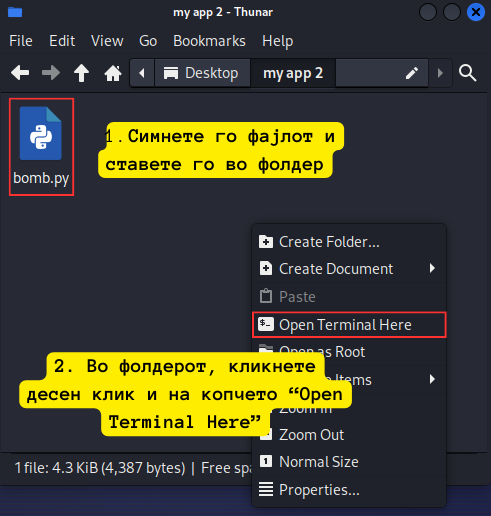
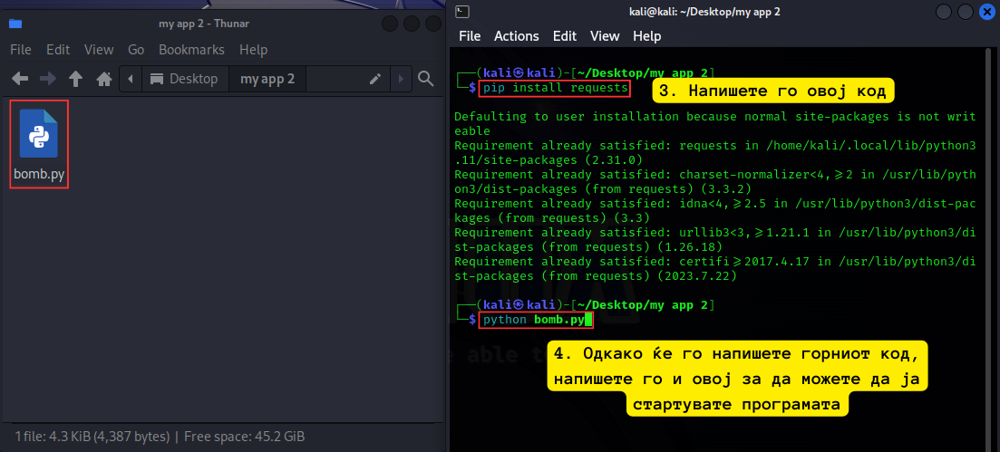
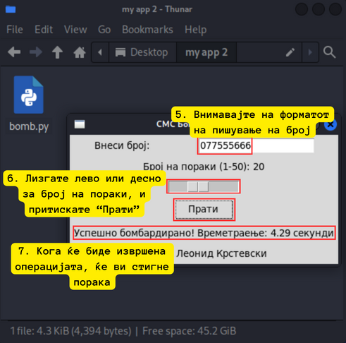

# Бомбардер на SMS пораки
Оваа апликација е креирана за автоматско праќање на SMS пораки со користење на веб страната на Sportal Klub.

## Упатство за користење:
Превземете ја скриптата од репозиториумот.
Ставете ја скриптата во вашата папка за подобро стартување.
Напишете ```pip install requests```
Стартувајте ја апликацијата со ```python bomb.py.```
Внесете го бројот на телефонот на кој сакате да се испраќаат пораки.
Внесете го бројот на SMS пораки што сакате да ги испратите со помош на лизгање надесно.
Кликнете на копчето "Испрати SMS пораки".

## Важно:
Бројот на телефон мора да се состои од 9 цифри, пример: 077555666 (без празни места/цртки).
Апликацијата може да испрати најмногу 50 SMS пораки во една сесија.
Ако се појави некоја грешка, истата ќе се прикаже во конзолата.
Кога сите пораки ќе бидат успешно испратени, ќе се прикаже пораката "Завршено" на екранот.





## Автор:
Апликацијата е креирана од страна на Леонид Крстевски.

### Забелешка:
Оваа апликација е наменета исклучиво за образовни цели и не треба да се користи за неетичко праќање на SMS пораки без дозвола. Авторот не презема одговорност за неправилна употреба на оваа апликација.
